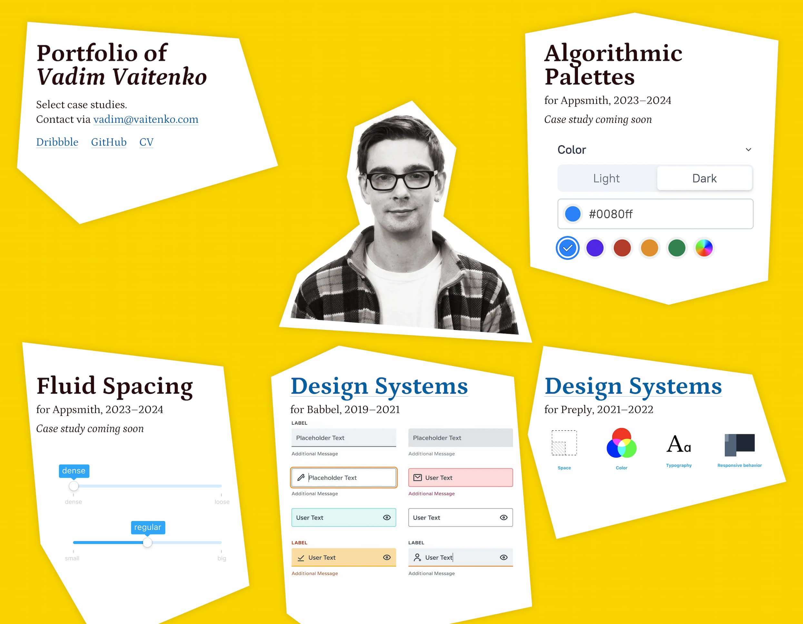

In autumn of 2022 I found myself with the burning urge of a new portfolio. I wanted something much simpler than the [old one](https://github.com/ichik/ichik.xyz) that despite all the niceties of modern tooling turned out to be much of a hassle to maintain than I hoped. I simply wanted to burn it all and start from scratch, and so here it is, a dead simple Gulp script where most of the things were painstakingly crafted by hand.

